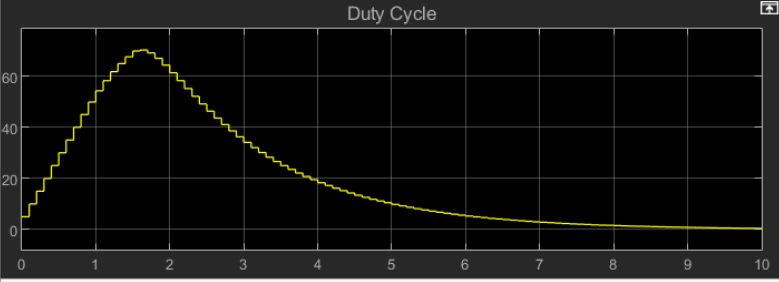

## Intro to Ball and Pipe Project
  For this project, there is a vertical pipe system that has a fan at the bottom. A ping pong ball is placed at the bottom and through the use of a controller, the ping pong ball will be shot up to any specific height the user wishes to choose. For this specific project, our group chose the MPC controller. Figure 3 shows the overall diagram. The MPC starts with a reference point, which is the path the user wants the ball to follow, and the initial height of the ball, the MPC will start updating after every time step. 
  
  After the first update, the output, which is the new height, is fed back into the input of the MPC block. This occurs over and over until the ball is at the desired height, and theoretically, the system will keep constant after this point. A problem that our simulation ran into was once the desired height was reached, the PWM output from the MPC block would go back down to 0, which then turned the fan off. 

## About MPC 
  MPC, or Model Predictive Control, is a very complex control method that utilizes predicition of future outputs to optimize system responses. It is special compared to other control methods in that it is designed with the intent to control much more demanding systems, such as multiple input, multiple output systems. Due to this ability, it is often used to model self-driving cars and autonomous vehicles that tend to converge at a specific point.
  
  MPC algorithms are typically extremely complex and computationally expensive, so prediction calculations are often offloaded to external computation algorithms. An example of an algorithm used for prediction in these controllers is a Quadratic Cost Function. This and similar functions take inputs like prediction horizons, reference trajectories, manipulated variables, and weighting coefficients.
  
  The prediction horizon is the value that determines how many inputs into the future are estimated. This value is typically chosen and remains untouched for the duration of the control. Increasing the prediction horizon can improve system estimations, but increasing the value too far results in diminishing returns. The prediction horizon is typically kept lower than 50 to ensure a stable response as well as shorter computation times.
  
  The manipulated variable (MV) is the part of the system that will have a direct effect on response. This value is most often what is manipulated in a MPC controlled system. MV values are continously predicted, out to the range of the prediction horizon, to try and match the reference trajectory. The reference trajectory is just as it sounds: a desired response of the system. An error check is performed on the MV value compared to the reference at that point, and predictions are updated to accomodate any changes.
  
  Finally, weighting coefficients are used to determine the magnitude of change on the MV. Changing weighting coefficients as well as horizons are both used to tune the response of the system to the desired outcome.
  
  We decided to use MPC for the Ball and Pipe project to predict what the transfer function will output instead of getting results and checking to see if the data is correct. MPC can be tuned to make the signal more or less aggressive for the predicted output, so you can manipulate the output to be as close as possible to the desired output. The transfer function needs to be converted to a space state model to output a useable signal for the ball and pipe system. Overall, MPC is usually used for more difficult simulations, and as such is overkill for the simplicity of the ball and pipe system.

## Code Guide
  To use the code with the designed MPC controller is simple. The controller takes in a measured output and generates the next input to use, as described before. In this case, the BNP system parameters needed are ball height, meters, and a PWM value. To use with the MPC, the ball height acts as the input to the measured output (MO) of the MPC, which predicts the subsequent best PWM values, which are then input to the BNP system with set_pwm(). This is achieved with input/output blocks through Simulink, with which the model can interface with MATLAB code, after importing. 

  The MPC block was designed with PWM constraints of 1000 to 4095, and ball height constraints of 0 to 1. The reference signal given to the system was the unit step, for simulation purposes. Additional constraints were added to reduce how large the jumps in PWM could be to coincide with the real-life limitations of the system. The PWM was only allowed to increase/decrease by a value of 100 at a time.

  To modify the MPC, the MPC designer tool in MATLAB can be accessed from the Simulink model by double-clicking the MPC block. Here, constraints can be edited and weights can be changed to increase/decrease the aggressiveness of the prediction model.

## Simulation Results

#### Figure 1: Simulated input, shown with duty cycle percentage

## References
https://www.mathworks.com/products/model-predictive-control.html 

https://www.mathworks.com/products/simcontrol.html 

https://en.wikipedia.org/wiki/Model_predictive_control

https://www.youtube.com/watch?v=YwodGM2eoy4

https://web.stanford.edu/class/archive/ee/ee392m/ee392m.1056/Lecture14_MPC.pdf

https://www.do-mpc.com/en/v4.1.1/theory_mpc.html
